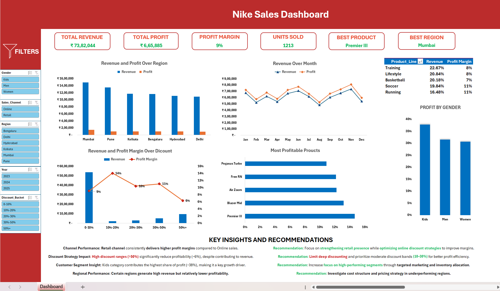
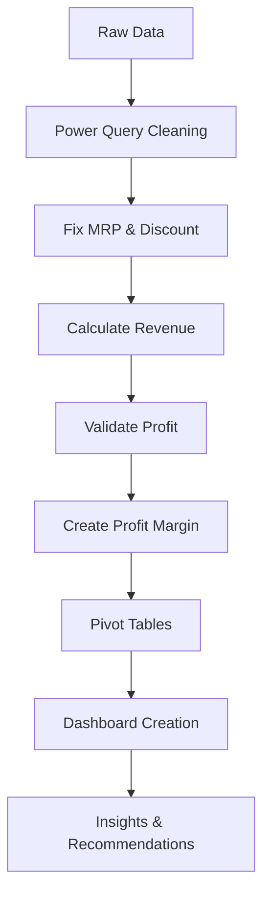

# 🏀 Nike Sales Analysis Dashboard (Excel + Power Query)

## 📌 Project Overview

This project analyzes Nike retail and online sales data to uncover insights related to **revenue, profitability, discount strategy, and customer segments**.

The goal was to transform raw, inconsistent data into a **fully interactive dashboard with actionable business insights**.

---

## 🖼️ Dashboard Preview



---

## 🎯 Objectives

* Clean and preprocess raw sales data
* Fix inconsistencies in MRP, Revenue, and Discount
* Analyze the impact of discounting on profitability
* Compare performance across regions, channels, and segments
* Build an interactive, insight-driven dashboard

---

## 🛠️ Tools & Technologies

* Microsoft Excel
* Power Query
* Pivot Tables
* Data Visualization (Charts, Slicers)

---

## 🧹 Data Cleaning & Transformation

### 🔹 Handling Missing & Incorrect Values

* Replaced null values using median and logical rules
* Standardized inconsistent region names

---

### 🔹 MRP Correction

* Grouped data by `Product_Name`
* Calculated **Median MRP**
* Merged results back into main dataset
* Created `MRP_Clean` column

---

### 🔹 Discount Fix

* Corrected values where discount > 1
* Standardized discount format

---

### 🔹 Revenue Calculation

```excel
Revenue = Units_Sold × MRP_Clean × (1 - Discount)
```

---

### 🔹 Profit Handling

* Retained provided Profit column
* Removed invalid rows (e.g., Units_Sold = 0 with non-zero Profit)

---

### 🔹 Profit Margin Calculation

```excel
Profit Margin = Profit / Revenue
```

⚠️ Calculated outside Pivot Table to ensure correct aggregation

---

## 📊 Dashboard Features

### 🔹 KPI Metrics

* **Total Revenue:** ₹73.8L
* **Total Profit:** ₹6.65L
* **Profit Margin:** 9%
* **Units Sold:** 1213

---

### 🔹 Key Visualizations

* Revenue & Profit by Region
* Monthly Revenue Trends
* Discount vs Profitability (Combo Chart)
* Category-wise Performance
* Most Profitable Products
* Profit Distribution by Gender

---

### 🔹 Interactive Filters

* Gender
* Region
* Sales Channel (Online / Retail)
* Year
* Discount Bucket

---

## 🔍 Key Insights & Recommendations

### 1. Channel Performance

Retail channel delivers higher profit margins compared to online sales.
→ Optimize online pricing and reduce excessive discounting.

---

### 2. Discount Strategy

High discount ranges (>50%) reduce profitability (~6%).
→ Focus on moderate discount bands (10–30%) for better efficiency.

---

### 3. Revenue Concentration

Over 70% of revenue comes from low discount (0–10%) sales.
→ Avoid unnecessary discounting on high-demand products.

---

### 4. Regional Performance

Some regions generate strong revenue but lower profitability.
→ Investigate pricing strategy and cost structure.

---

### 5. Customer Segment

Kids category contributes the highest share of profit.
→ Increase focus on high-performing segments.

---

## 🔄 Data Workflow



---

## 🚀 Project Outcome

* Built an end-to-end data analysis pipeline
* Converted raw data into actionable business insights
* Designed an interactive dashboard for decision-making

---

## 📌 Future Improvements

* Build advanced dashboard in Power BI
* Include cost data for accurate profit modeling
* Add automated data refresh

---

## 👤 Author

**Harsh Vardhan**

---

## ⭐ If you found this useful

Consider giving this repo a star ⭐

